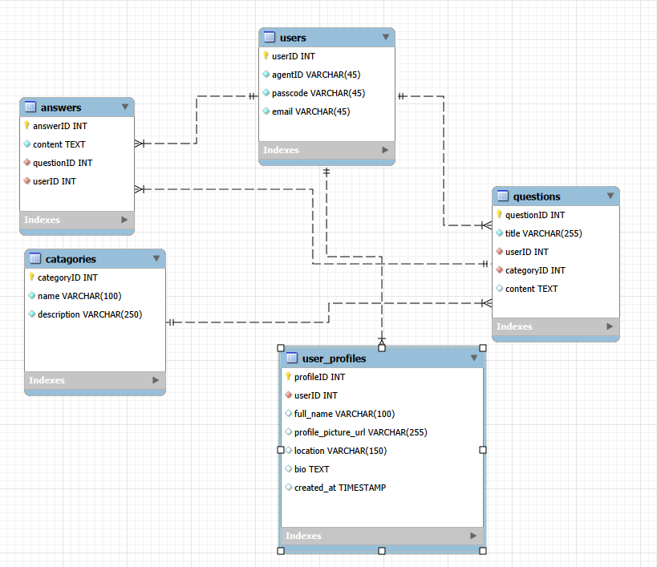
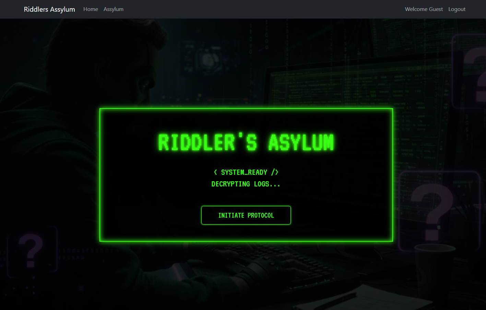
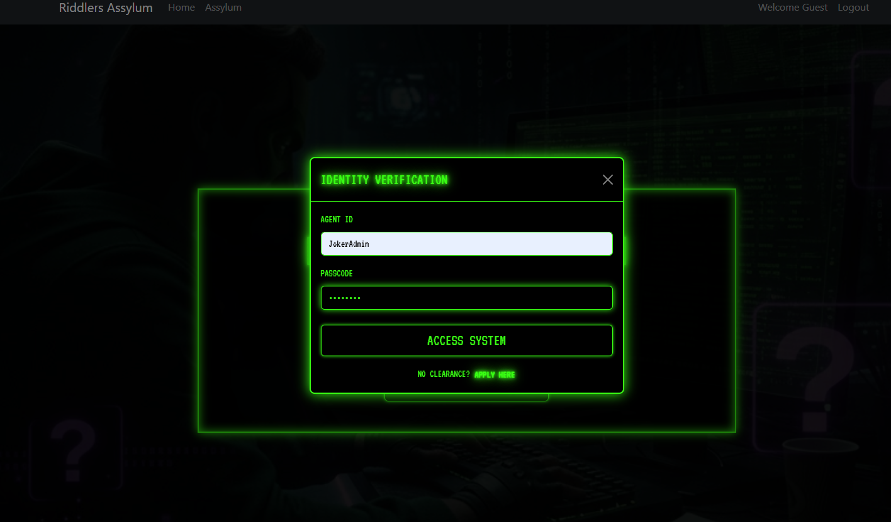
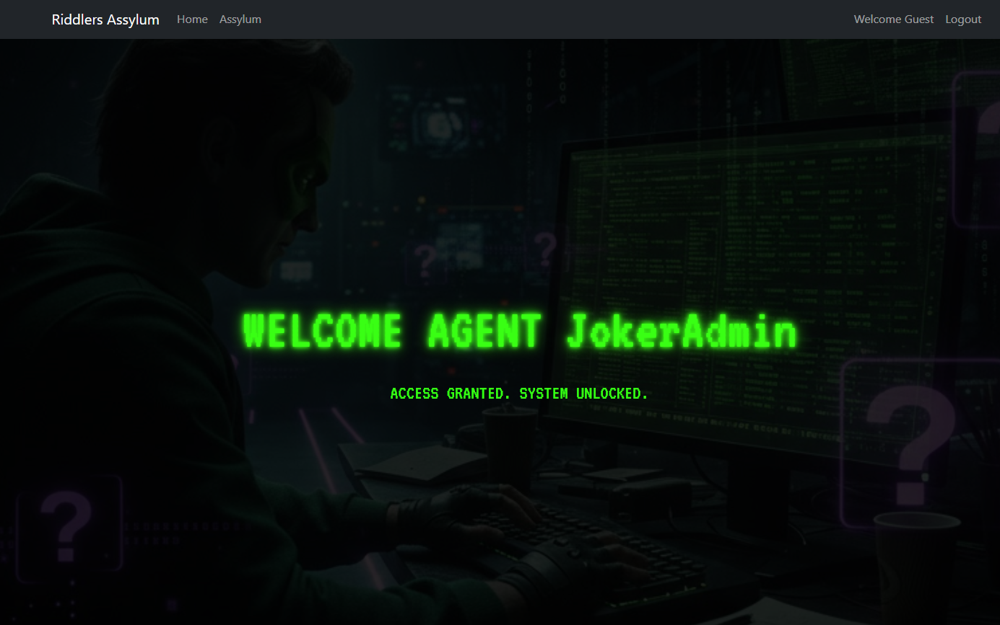
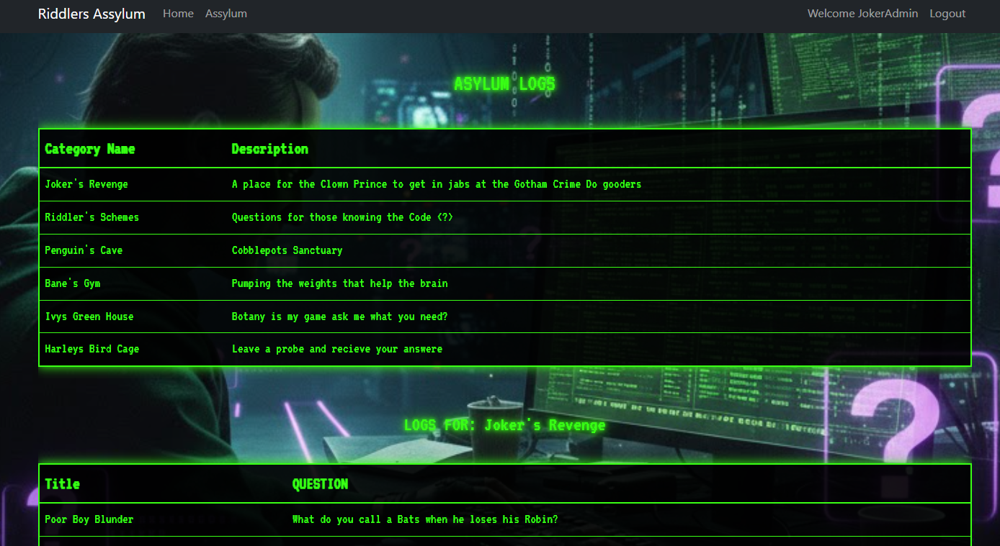
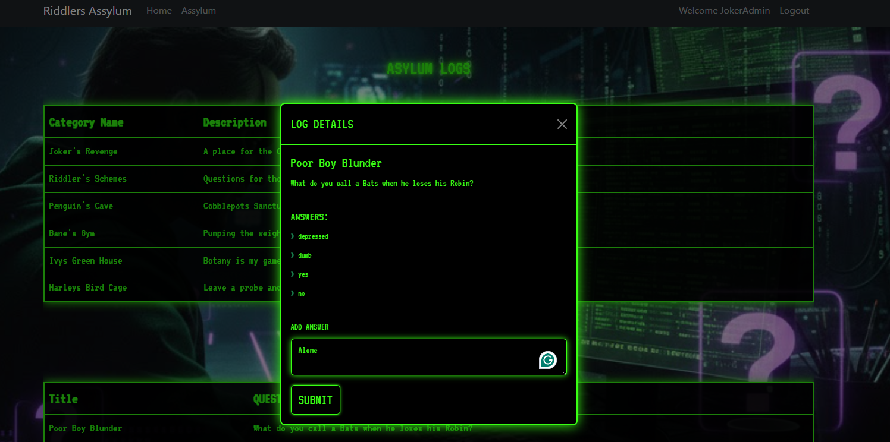

# Riddlers Assylum
Riddlers assylum should be a message board that looks like it was pulled out of a Arkham Knights style video game where the Riddler uses his tech prowess to set up a message board for the villains of the land. Made ro have a modern Hacker feel like you would see in the Theater. Using a Black and green theme to relive the old DOS days of computer programing and hacking.

## Technology
1. MySQL
2. React
3. express
4. Bootstrap
5. JSON
6. Node.Js
7. Html
8. CSS
9. JS


## User Stories
1. As a user i want to feel the 80's batman hacker style nostalgia
2. As a user i want it to seam like info is hidden untill items are requested
3. As a user i would like there to be some element representing early computer hacking a DOS screens

## Wire Frame


<br/>





 

## MYSQL DB setup 

    Name the database "qanda"
    there are 4 tables
```
        CREATE TABLE `users` (
            `userID` int NOT NULL AUTO_INCREMENT,
            `agentID` varchar(45) NOT NULL,
            `passcode` varchar(45) NOT NULL,
            `email` varchar(45) NOT NULL,
            PRIMARY KEY (`userID`)
        ) 
        CREATE TABLE `categories` (
            `categoryID` int NOT NULL AUTO_INCREMENT,
            `name` varchar(100) NOT NULL,
            `description` varchar(250) NOT NULL,
            PRIMARY KEY (`categoryID`)
        )
        CREATE TABLE `questions` (
            `questionID` int NOT NULL AUTO_INCREMENT,
            `title` varchar(255) NOT NULL,
            `userID` int NOT NULL,
            `categoryID` int NOT NULL,
            `content` text,
            PRIMARY KEY (`questionID`),
            KEY `fk_user` (`userID`),
            KEY `fk_catagory` (`categoryID`),
            CONSTRAINT `fk_catagory` FOREIGN KEY (`categoryID`) REFERENCES `categories` (`categoryID`) ON DELETE CASCADE,
            CONSTRAINT `fk_user` FOREIGN KEY (`userID`) REFERENCES `users` (`userID`) ON DELETE CASCADE
        )
        CREATE TABLE `answers` (
            `answerID` int NOT NULL AUTO_INCREMENT,
            `content` text NOT NULL,
            `questionID` int NOT NULL,
            `userID` int NOT NULL,
            PRIMARY KEY (`answerID`),
            KEY `fk_answer_question` (`questionID`),
            KEY `fk_answer_user` (`userID`),
            CONSTRAINT `fk_answer_question` FOREIGN KEY (`questionID`) REFERENCES `questions` (`questionID`) ON DELETE CASCADE,
            CONSTRAINT `fk_answer_user` FOREIGN KEY (`userID`) REFERENCES `users` (`userID`) ON DELETE CASCADE
        ) 
        ```


## Future Additions

In the future i would also like to add a Profiles page where the user logged in can view their information and upload pictures and maybe also put a private message type list inside the profile page where users can interact with each other . the profile page should have an area to track how many questions they have posted and how many answeres they have given.

## Author

Benjamin Rose Linkdin: www.linkedin.com/in/benjamin-rose-tech